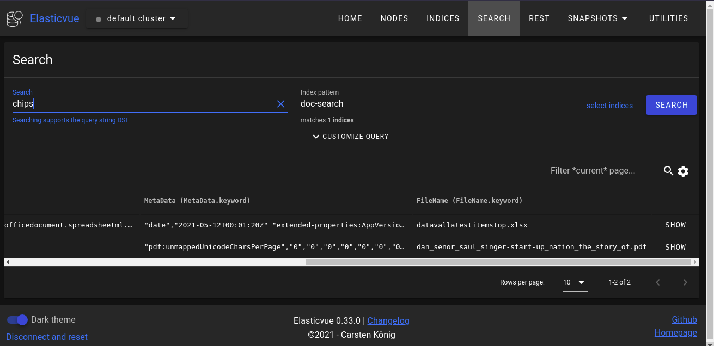
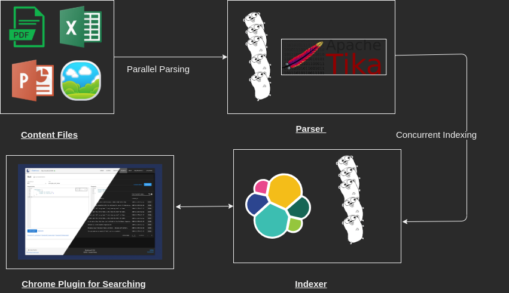

## Falabella

[](https://goreportcard.com/report/github.com/YashMeh/Falabella)


Falabella is a content(PDF,PPT,XLSX,CSV etc..) loading and searching software that can be used to rank content based on the given keywords. It uses [apache tika](https://tika.apache.org/) to parse the files and load them to a given [elasticsearch](https://www.elastic.co/) server which can then be used for searching.

### How to run

- Download the binary from [here](https://github.com/YashMeh/Falabella/releases/tag/0.0.1)
- Create a config.yaml file in the same directory and pass the configurations

```yaml
services:
  elasticSearch: http://localhost:9200
  apacheTika: http://localhost:9998

# Path for which you want to index the documents
appConfig:
  filePath: ./assets/
```

- Run the binary and it will index different kinds of documents (PDF,PPT,XLSX,CSV).

```
./Flabella
```

- Download the elasticvue plugin(or anything similar) from [here](https://chrome.google.com/webstore/detail/elasticvue/hkedbapjpblbodpgbajblpnlpenaebaa?hl=en)
- Goto the plugin and search the keywords.

### Running Demo

<p align="center"></p>

### Usecases

- Ranking huge number of research papers based on a certain keyword.
- Seaching for keywords through different kinds of documents and all at once.
  and more..

### Architecture

It stores the content type, metdata and body of the documents and uses goroutines to -

- Parallely process and parse files.
- Concurrently loads them to elasticsearch without waiting for all the files to get parsed.
If you want to read how elasticsearch rank documents you can read [here](https://www.compose.com/articles/how-scoring-works-in-elasticsearch/#:~:text=Before%20Elasticsearch%20starts%20scoring%20documents,are%20rank%20ordered%20for%20relevancy.).
<p align="center"></p>

### Work Left

1. Add OCR service for dealing with text containing images.
2. Add a service to deal with audio/video files.

### Yash Mehrotra

##  

```C++
if(repo.isAwesome || repo.isHelpful){
    StarRepo();
}
```
